# Cargento future UI: visual walkthrough

This collection explains the accepted `future-ui-command-surface` experiment. It compares the original inventory-first UI with a new exception-first command surface designed to answer five questions quickly:

1. Where am I?
2. What is happening now?
3. What needs me?
4. What is blocked or uncertain?
5. Where can I inspect the underlying evidence?

The “after” screenshots were captured from the live local payload on 2026-09-01 from `feat/future-ui` at commit `1cb112e`. Session text, counts, and elapsed times are live data and will vary between runs.

## The 30-second explanation

> Cargento used to start with what exists. The new direction starts with what needs understanding or action. Attention summarizes the observed fleet and says how complete the evidence is; Projects and Sessions remain one click away as full maps. Drill-downs only show facts that harnesses actually publish. Missing source data is qualified or omitted instead of being turned into a vague error or an invented status.

## Before: the lede was buried

### 1. Overview led with inventory and unexplained system language

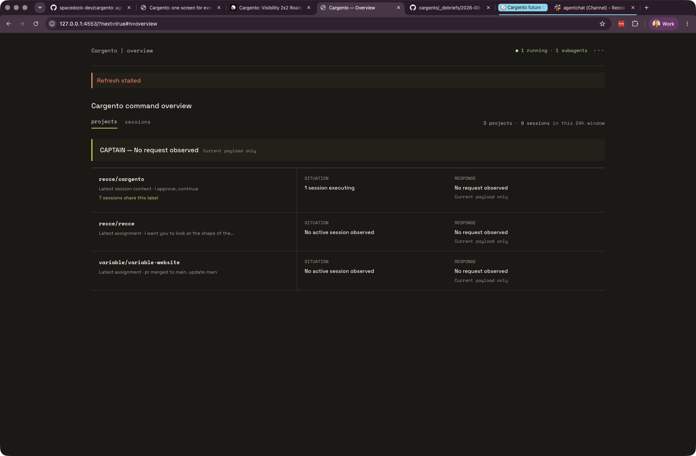

The original overview starts with a generic “Refresh stalled” error, a global Captain statement, and then a project list. It does not first tell the user whether anything needs attention or whether the apparent error changes what they should do.

### 2. Project detail exposed implementation gaps as product messages

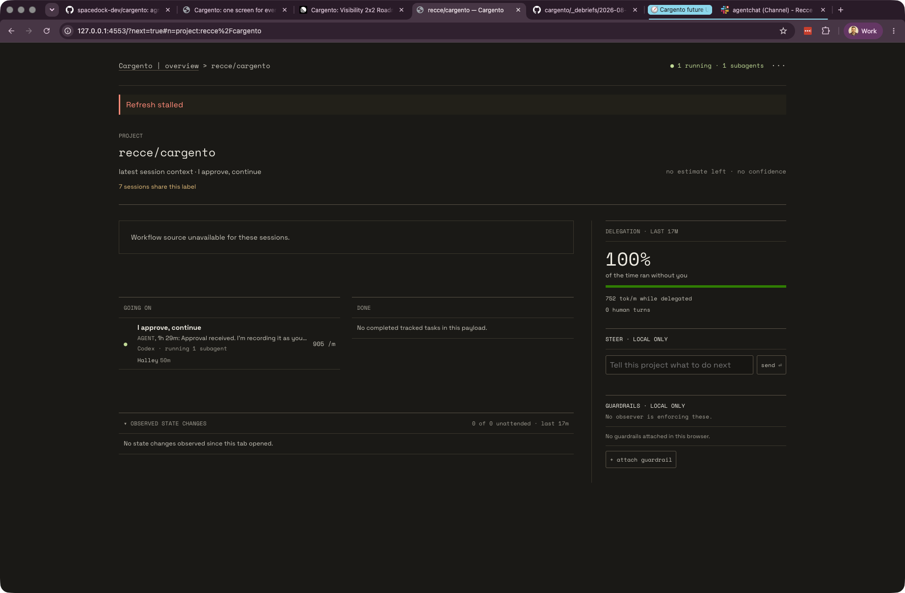

“Workflow source unavailable for these sessions” describes a missing input, but not its consequence. The page also gives a large amount of space to delegation and local controls before establishing the project’s current situation.

### 3. Empty concepts looked like broken features

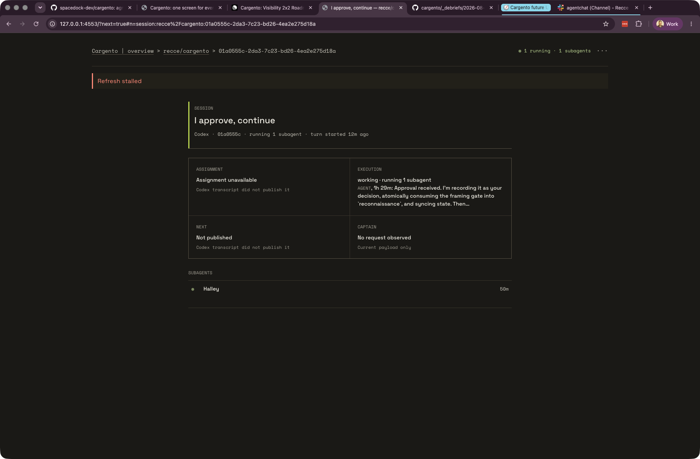

Assignment, Next, and Captain appeared even when the harness had not published those facts. The result implies that Cargento failed to find expected information, when the more honest statement is that those concepts are not available from every source.

## After: attention first, evidence always reachable

### 4. Attention is the default command surface

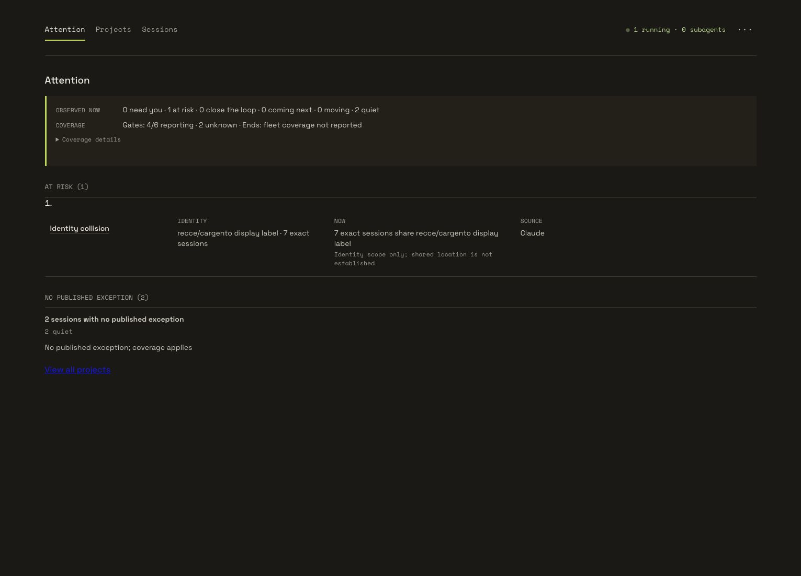

The first screen now leads with the observed fleet: what needs the user, what is at risk, what is moving, what is quiet, and where evidence coverage is incomplete. The queue is exception-first; normal inventory does not outrank a risk or an exact request.

Only a source-published request can create Captain responsibility. When there is no exact ask, the UI says so instead of turning absence into a global “No request observed” banner.

### 5. Uncertainty is inspectable, not a generic failure

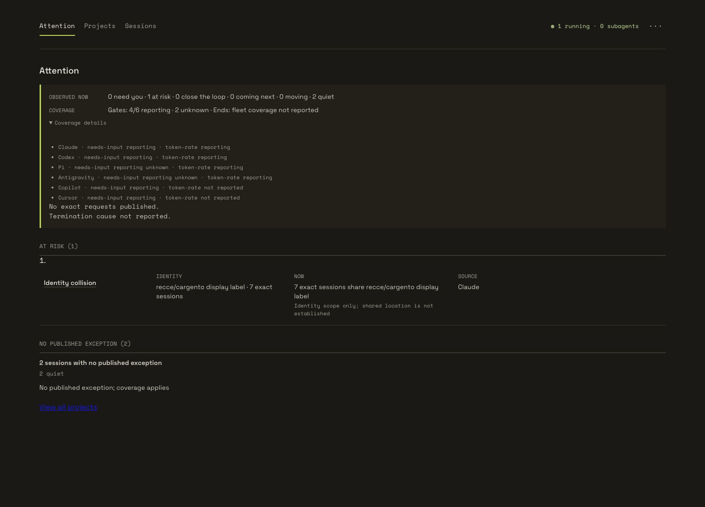

The evidence disclosure explains which harnesses report needs-input and token-rate signals and which do not. “Unknown” therefore has a concrete boundary. It no longer masquerades as “stalled,” “unavailable,” or a fact Cargento can infer.

### 6. The full project map remains one click away

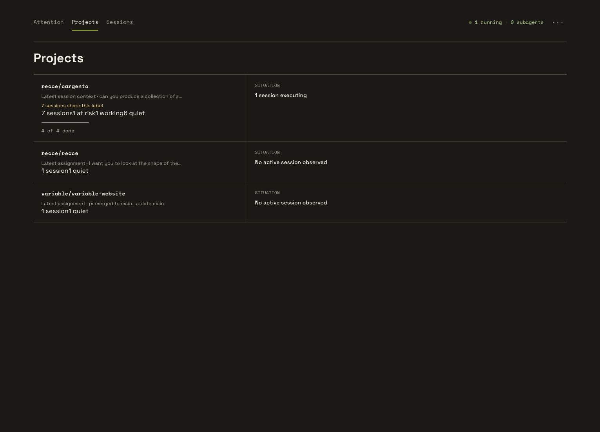

The exception-first landing does not remove inventory. Projects provides the stable fleet map, counts, latest context, and current situation for every project after the user has seen the lede.

### 7. Sessions provides a flat cross-harness map

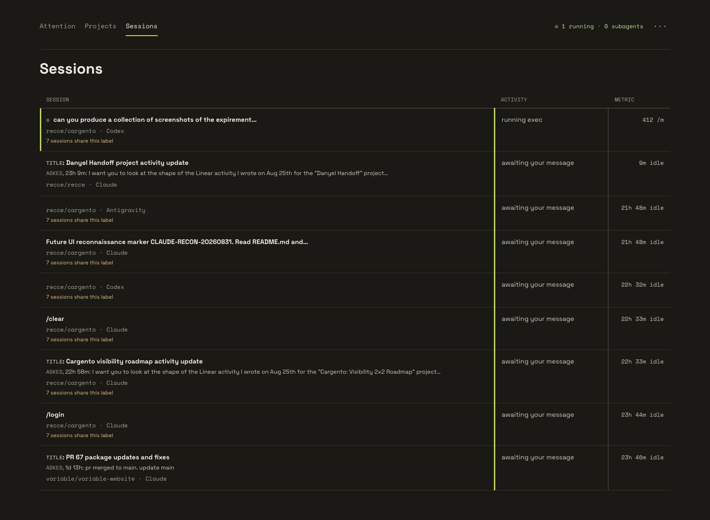

Users operating many agents can scan sessions across harnesses without first remembering which project owns them. Harness, current activity, timing, and available metrics share one comparable surface.

## Drill down without losing the operational story

### 8. Project detail separates motion, completion, and controls

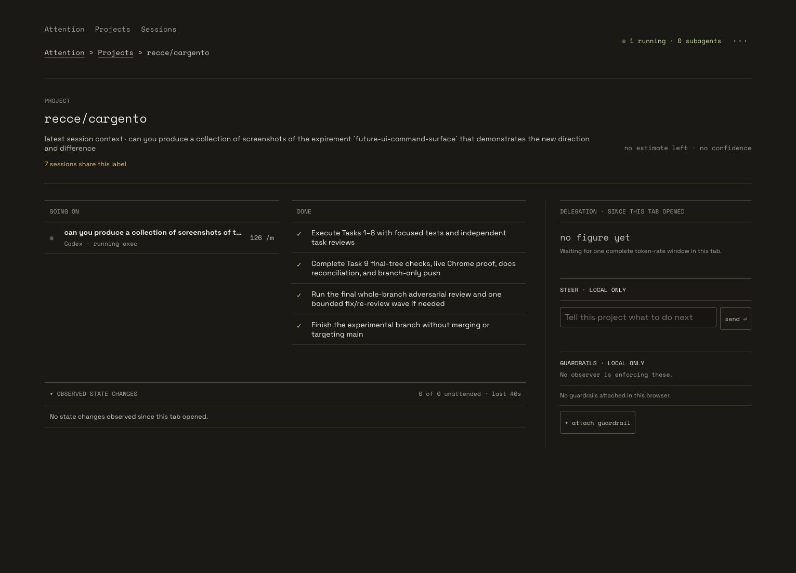

The project page answers “what is going on?” and “what finished?” before showing delegation, steering, and guardrails. Controls remain available, but they no longer become the project’s headline.

### 9. A Codex session shows current activity and tracked work

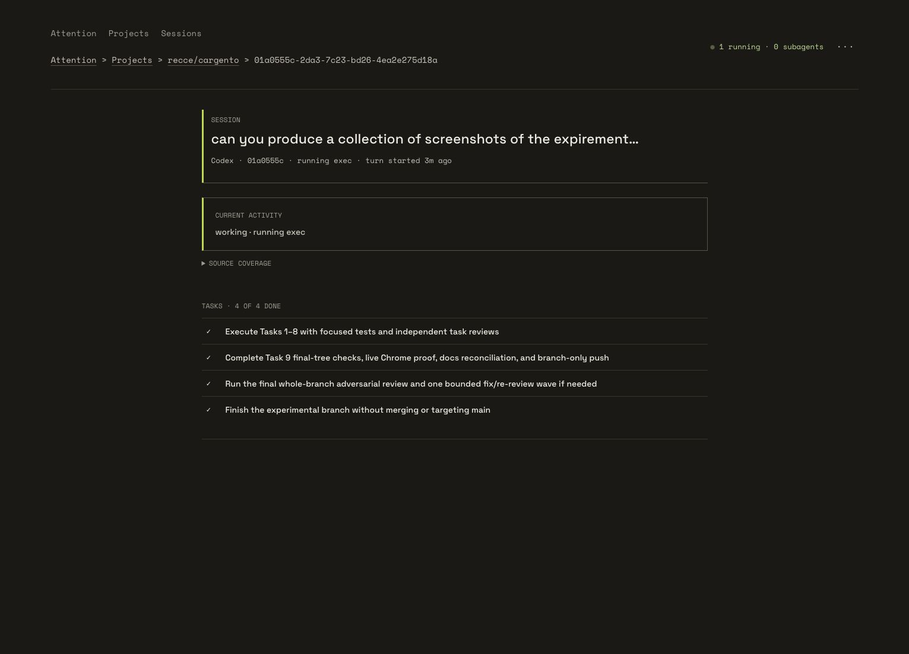

The session lede is source-backed current activity. Tracked tasks appear when the harness publishes them, giving the user both the top line and the evidence behind it.

### 10. Assignment appears when a source actually publishes one

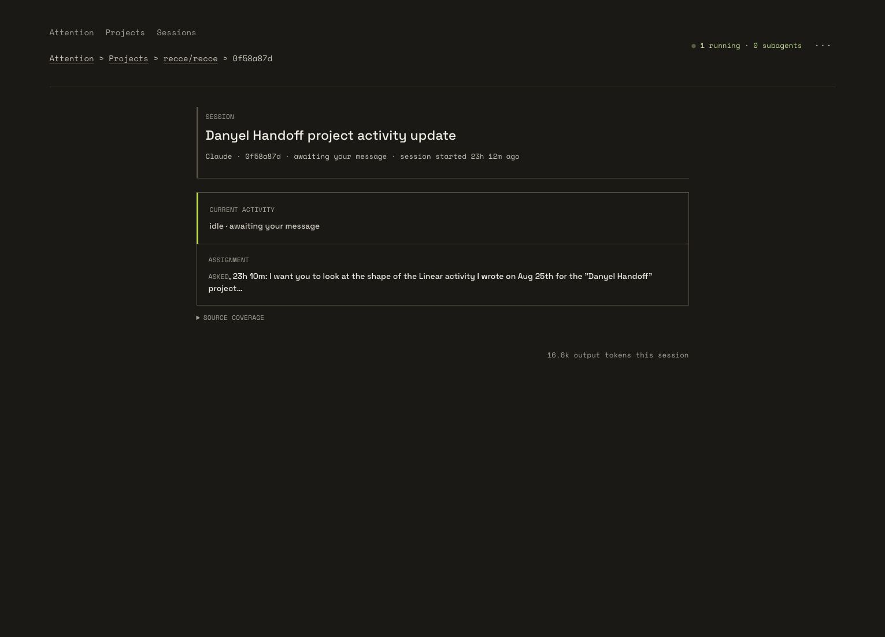

The Claude example includes Assignment because the transcript provides it. This makes the field meaningful: its presence is evidence, not a permanent box waiting to be filled.

### 11. Sparse sources stay honest

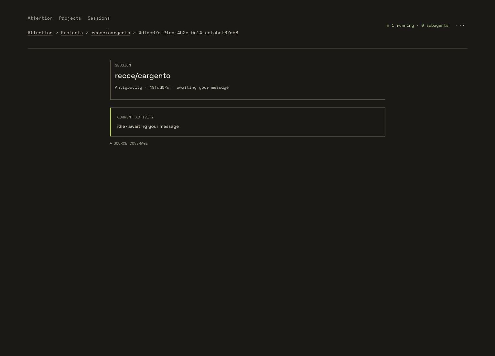

The Antigravity example shows only what its source supports. Cargento does not fabricate Assignment, Next, or Captain placeholders to make every harness look structurally identical.

## Responsive behavior

### 12. The command surface survives a 320-pixel viewport

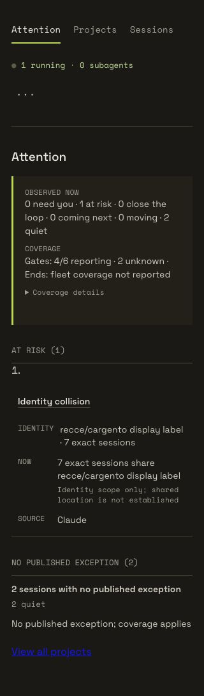

At narrow width, the same priority order remains intact, the primary location stays clear, and the page avoids horizontal overflow. The layout changes without changing the operational meaning.

## What changed

| Concern | Original direction | Experiment direction |
|---|---|---|
| Default landing | Project inventory | Exception-first Attention queue |
| First question answered | “What exists?” | “What needs understanding or action?” |
| Responsibility | Global Captain message | Exact, source-published requests only |
| Missing data | Empty boxes and generic errors | Qualified evidence coverage or omission |
| Fleet access | Project-centric list | Projects plus a cross-harness Sessions map |
| Detail pages | Fixed conceptual slots | Source-backed current activity and facts |
| Scale | Inventory competes with exceptions | Bounded priority sections with access to full maps |
| Narrow screens | Priority was not explicit | Same lede and navigation without overflow |

## Honest boundaries of this capture

- The live payload had no exact asks, stopped sessions, or sections with more than three subjects during capture. The implementation’s behavior tests cover those branches, but this collection does not pretend the live environment demonstrated them.
- Direct browser geometry for source-absent Retry, gate, answer, and expanded-overflow states remains an accepted validation gap from the experiment.
- These images contain real local session text. Review them before sharing outside the intended audience.
