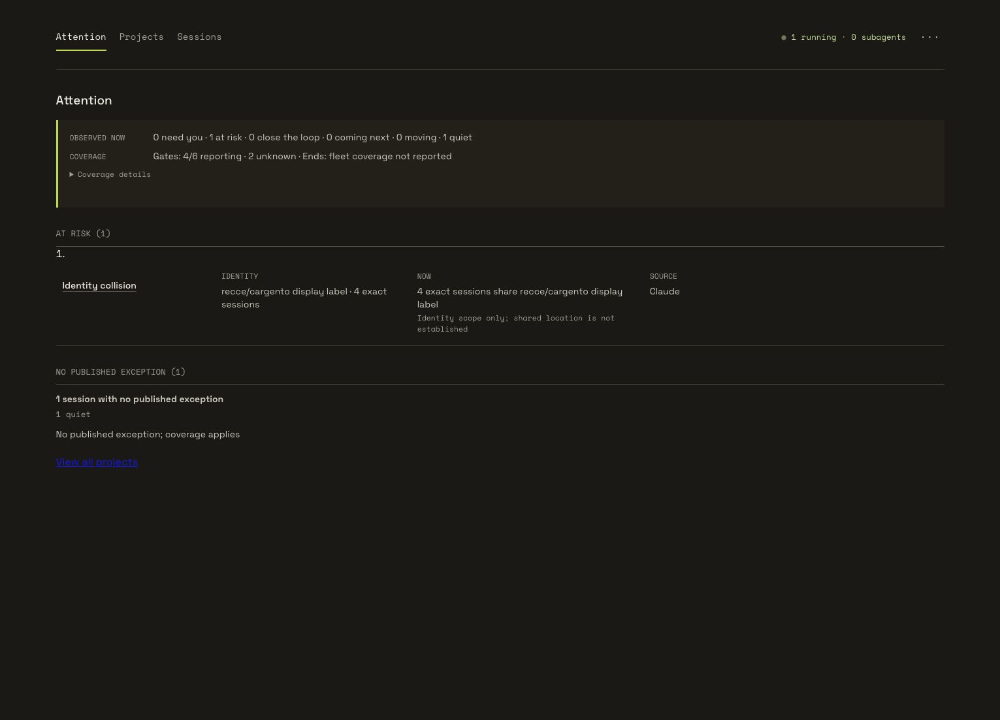
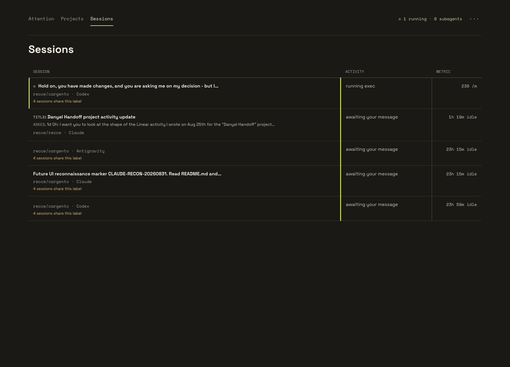
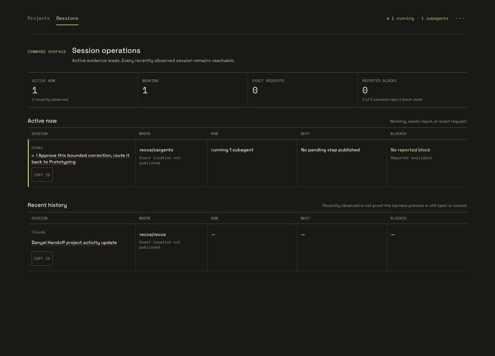
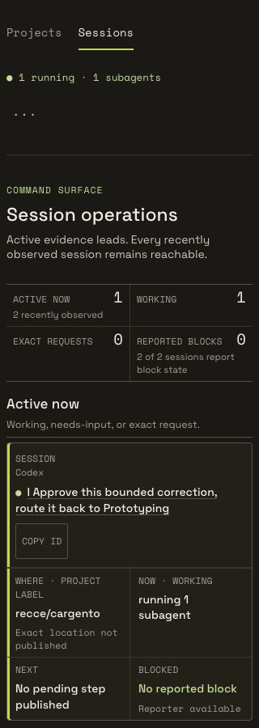
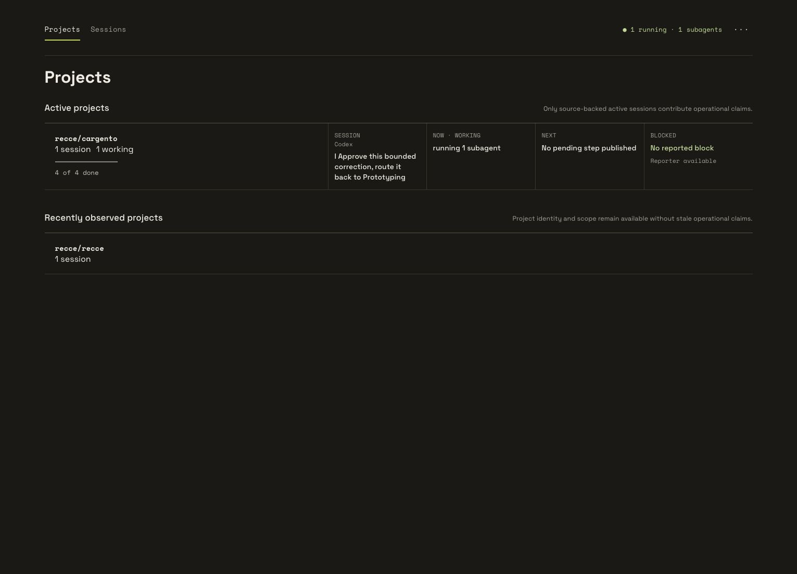
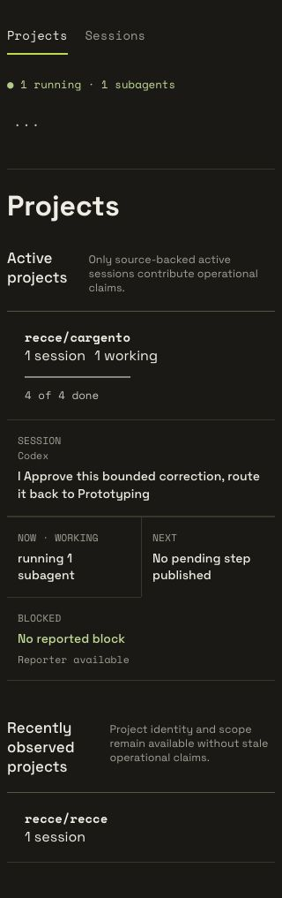

# Cargento future UI: session operations board

This review package explains the `future-ui-session-operations-board` experiment for people who did not follow the design process. It shows why the prior Attention direction was rejected and how the replacement helps a person answer four questions:

- Which sessions are active now?
- What is each active session doing now?
- What will each active session do next?
- Is an active session blocked or waiting on me?

The approved screenshots come from `feat/future-ui` at commit `819a1a8`. They use real local session data, so names and activity text will differ in another environment.

## The short version

- Active work leads. Recent history stays available in a separate section and cannot look like an open session.
- Each active session answers Where, Now, Next, and Blocked in one scan.
- The board shows column headings once. Rows do not repeat labels that the reader already saw.
- Historical rows keep command columns neutral because old observations cannot prove current state.
- Session IDs stay behind a copy control until someone needs one.
- Optional facts, such as an unpublished assignment, disappear instead of becoming empty warnings.
- Projects expose the same exact active-session facts without collapsing several sessions into one vague count.
- The 320-pixel layout uses readable cards and a compact fleet summary without horizontal overflow.

## Before: attention competed with the fleet

### The default view started with categories instead of active work

The Attention model asked the reader to interpret risk buckets, evidence coverage, and identity collisions before answering which sessions were active. The page could be technically honest and still bury the operational question.

### Active and historical sessions looked too similar

The first Sessions board repeated column labels inside every row and gave recently observed sessions values under Now, Next, and Blocked. A reader could reasonably think every visible row represented an open session.

## After: active sessions lead

### Wide Sessions view

The fleet summary states how many sessions are active and how many are only recent observations. Active sessions appear first with their command facts. History appears below as identity and scope, not live command state.

### Mobile Sessions view

At 320 pixels, the fleet facts use a 2-by-2 summary and the first active session fits in the initial viewport. Each session becomes a card, which preserves reading order without forcing a miniature desktop table.

### Wide Projects view

Projects remain a full fleet map. An active project now lists each exact active session and its Now, Next, and Blocked facts. Recently observed projects stay concise because old evidence cannot describe current commands.

### Mobile Projects view

The narrow Projects view keeps active sessions and their command facts together. It does not reduce the page to project counts or hide the active session behind another route.

## What changed in the product

- The Sessions page separates `Active now` from `Recent history`.
- Active status requires source-backed working, needs-input, or exact-request evidence.
- The board routes exact sessions by harness and session ID, so matching IDs from two harnesses remain distinct.
- Desktop rows use one shared column grid. Mobile rows use cards with one label per fact.
- Historical Now, Next, and Blocked cells render as `-`.
- The session ID control reveals the ID on hover or focus and copies it with visible confirmation.
- Assignment text appears only when a harness publishes a real assignment.
- Projects show exact active-session command facts and keep historical projects observational.
- Session detail gives current activity the visual lead and keeps active subagents with that activity.

## The Spacedock workflow

The [Future UI Exploration workflow](../../README.md) is part of this review package. It records the process used to reach this direction:

- Framing turns the product question into a falsifiable design bet.
- Reconnaissance observes real Codex, Claude Code, and Antigravity sessions.
- Prototyping changes only the experimental `?next=true` interface on `feat/future-ui`.
- Crucible asks fresh reviewers to disprove the visual hierarchy, command truth, and cross-harness behavior.
- Accepted records the approved checkpoint without authorizing a merge to `main`.

The workflow keeps its live run record on the split-root Spacedock state branch. The repository tracks the reusable workflow definition and this shareable evidence package.

## Scope

- This is an experimental direction for `http://127.0.0.1:4553/?next=true`.
- The PR targets `feat/future-ui`, not `main`.
- The screenshots contain real local session text. Review them before sharing outside the intended audience.
