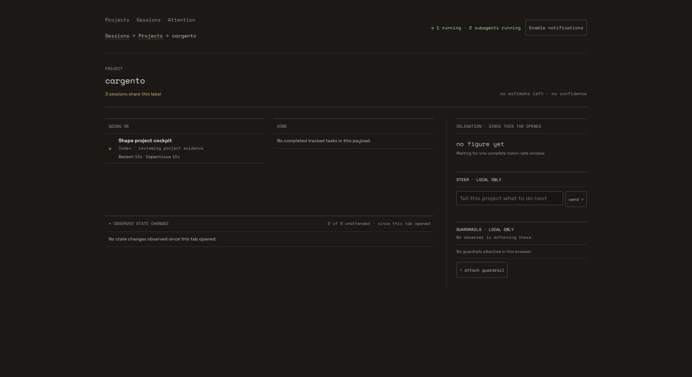
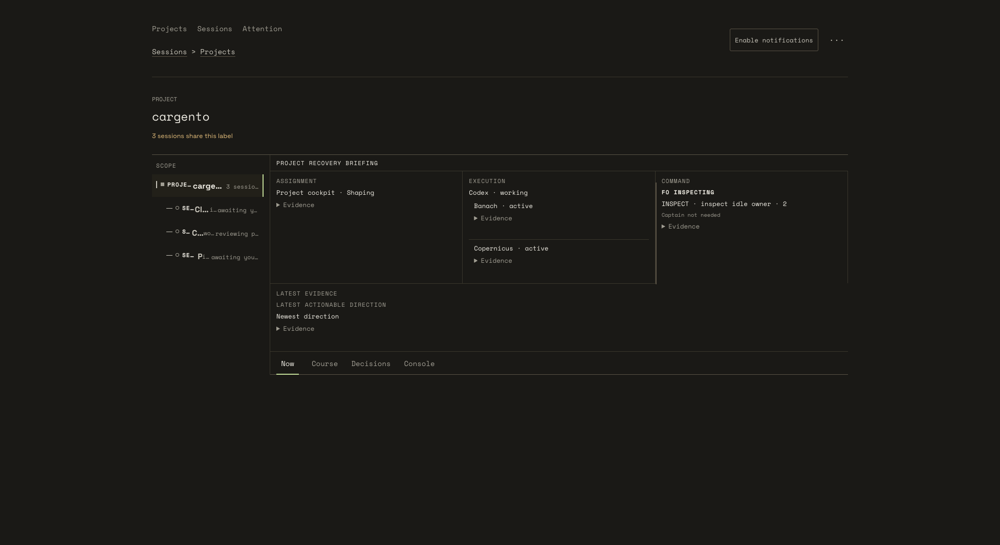
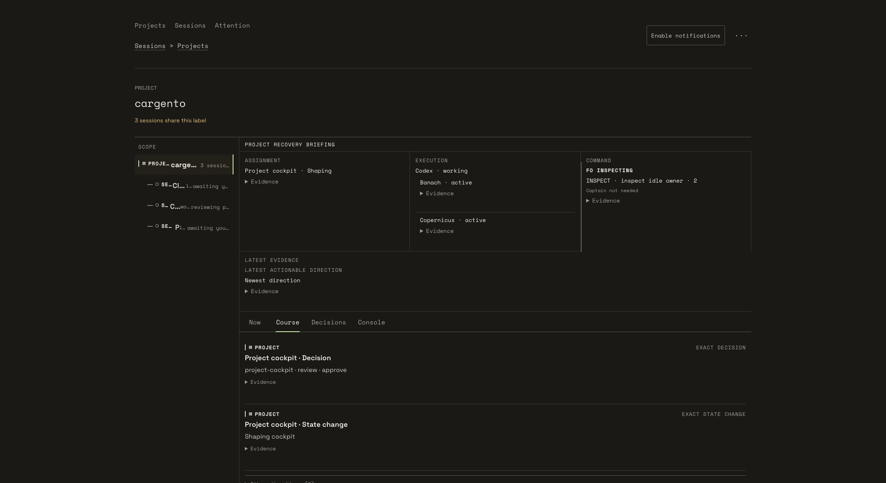
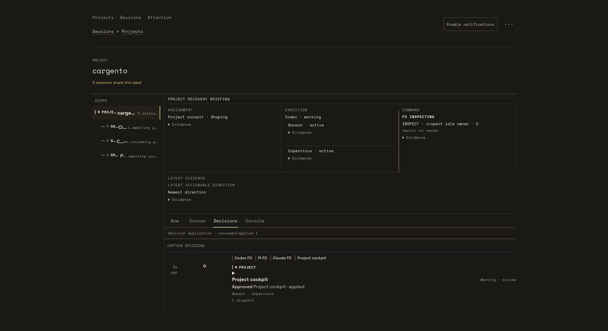
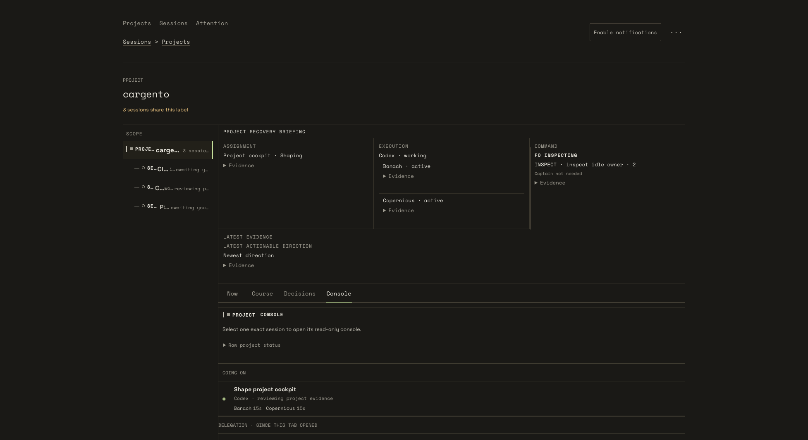
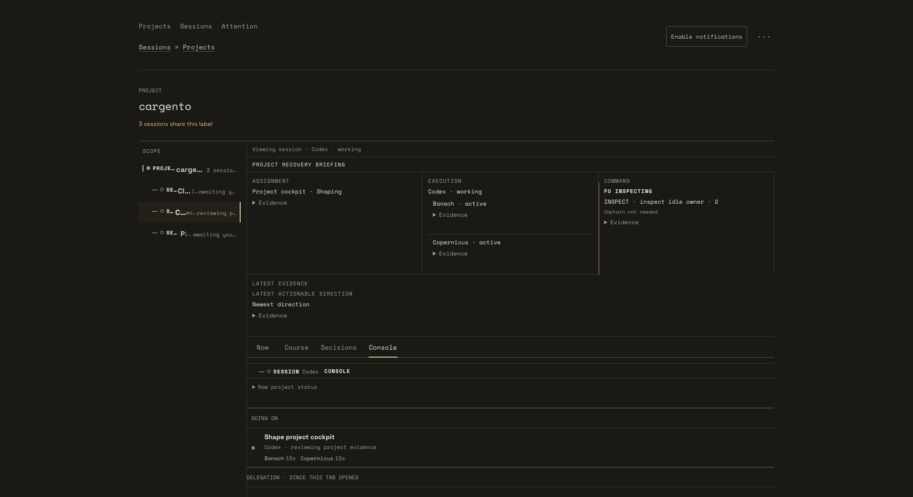

# Operator cockpit: design review

This branch imports the three commits from `clkao/cargento` at `3ed3209` and merges
Cargento main through `58caa25`. It preserves the prototype for a later design pass.

The project page now opens with a recovery briefing: the assignment, who is working,
what needs attention, and the latest evidence. A scope rail switches between the
project and one exact session. Course, Decisions, and Console separate history,
recorded decisions, and operational detail. Browser-local context and a copyable
briefing help an operator resume work without reconstructing it from transcripts.

The backend adds project identity, child assignments and lifecycle evidence,
semantic history, and an optional read-only terminal bridge. The merge retains
main's focus, history, source-gap, credential-redaction, and draft-preservation
behavior. Finished teammates no longer count as active cockpit work.

## User journeys

Start the server from this branch's worktree, using a spare port:

```bash
python3 cargento/skills/cargento/server.py --port 18886 --no-usage --no-git
```

Open `http://127.0.0.1:18886/`. The two switches keep quota fetching and git probes
off during a design review; they do not disable project-context analysis.

| Need | Path through the UI | Value and limit |
|---|---|---|
| Resume a project | Projects > project > Now; open Evidence where needed | Read assignment, execution, attention, and provenance together. Missing readings remain explicit. |
| Follow one session | Select a session in the scope rail; select PROJECT to return | Keep the current tab while narrowing the view. The recovery briefing retains project context. |
| Understand a change of direction | Project > Course > Evidence or Other directions | See source-backed state changes and supporting directions. It is a bounded history, not a complete transcript. |
| Check prior decisions | Project > Decisions | Inspect recorded decisions and their application state. This view does not itself grant approval. |
| Add human context or hand off | Now > + Add human context, or More > Add human context; More > Copy briefing | Save context in this browser and copy the current briefing. Notes do not instruct an agent. |
| Inspect operational detail | Project > Console; select one exact session for its console | Keep raw status, activity, delegation, and local controls together. Terminal output requires explicit registration; typing into an agent is unsupported. |

The terminal is an optional prototype path. Start with both
`--interaction-origin-session <harness:sid>` and
`--interaction-origin-registration-file <private-file>`, then run the registration
client inside that session's tmux pane using the generated configuration. Merely
selecting Console does not create or register a terminal. The
[security contract](../../../SECURITY.md#operator-cockpit-prototype) describes its
capabilities and the separate project-context reads. The
[stable-server guide](STABLE_SERVER.md) covers following a remote checkpoint.

## Screenshots

Captured on 2026-09-08 in Chrome at its existing 1954 x 1066 viewport. Main and the
branch use the same synthetic Codex, Claude, and Pi sessions, derived from
`NextCockpitCompositionTest.FIXTURE`. No local transcript content or live terminal
output is included. The Console images show project and exact-session scope with
no registered terminal. These are prototype review evidence, not a completed design.

Main: project activity, observed state changes, and local controls.



Branch: recovery briefing and project/session scope.



Branch: course changes and their evidence.



Branch: recorded decisions and application state.



Branch: Console at project scope.



Branch: Console after selecting one exact session.



For the design pass, the narrow scope rail truncates labels even at this viewport,
and the project briefing remains prominent when a session is selected. Review that
hierarchy alongside the discoverability of Evidence and the More menu. Registration,
missing evidence, empty history, and unmeasured delegation each need a clear state.
